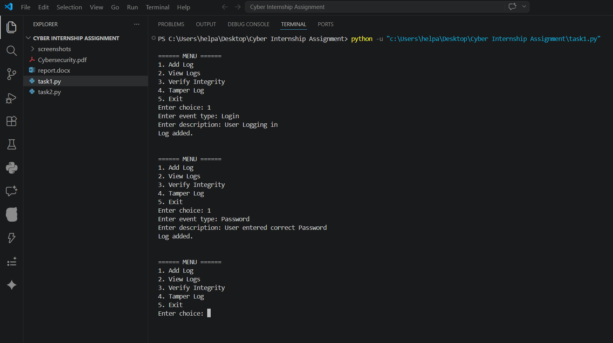
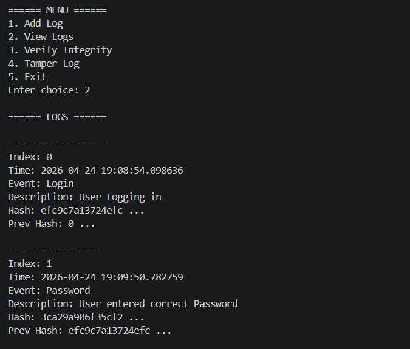
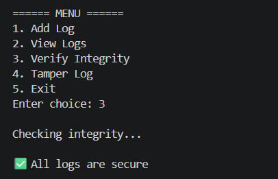
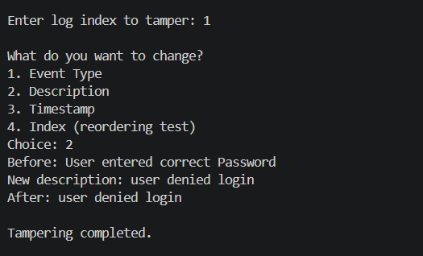
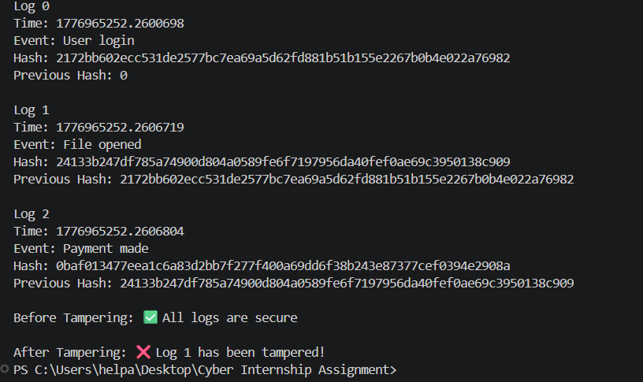
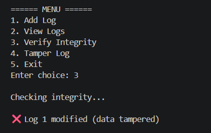

# tamper-evident-logging-system

## Overview
Python based secure log integrity and tamper detection system.

## Features
- Secure hash generation
- Hash chain verification
- Tamper detection
- Log order validation
- Interactive menu system

## Technologies Used
- Python
- hashlib
- datetime

## Cybersecurity Concepts
- Integrity verification
- Secure logging
- Forensic validation
- Tamper detection

## Future Improvements
- GUI dashboard
- Real-time monitoring
- AES encryption
- Exportable logs

## Screenshots
### Adding log entries

### Viewing logs

### Integrity Check No Tampering

### Before Tampering

### After Tampering

### Tampering detection

  
